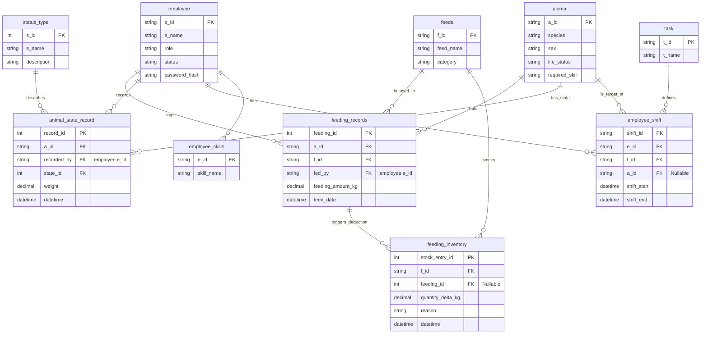

# Zoo Database ER Diagram

```mermaid
erDiagram
    %% Entities
    employee {
        string e_id PK
        string e_name
        string role
        string status
        string password_hash
    }

    animal {
        string a_id PK
        string species
        string sex
        string life_status
        string required_skill
    }

    feeds {
        string f_id PK
        string feed_name
        string category
    }

    task {
        string t_id PK
        string t_name
    }

    status_type {
        int s_id PK
        string s_name
        string description
    }

    %% Relationships & Transactions
    feeding_records {
        int feeding_id PK
        string a_id FK
        string f_id FK
        string fed_by FK "employee.e_id"
        decimal feeding_amount_kg
        datetime feed_date
    }

    animal_state_record {
        int record_id PK
        string a_id FK
        string recorded_by FK "employee.e_id"
        int state_id FK
        decimal weight
        datetime datetime
    }

    feeding_inventory {
        int stock_entry_id PK
        string f_id FK
        int feeding_id FK "Nullable"
        decimal quantity_delta_kg
        string reason
        datetime datetime
    }

    employee_shift {
        string shift_id PK
        string e_id FK
        string t_id FK
        string a_id FK "Nullable"
        datetime shift_start
        datetime shift_end
    }

    employee_skills {
        string e_id FK
        string skill_name
    }

    %% Relationships Lines
    employee ||--o{ feeding_records : "logs"
    employee ||--o{ animal_state_record : "records"
    employee ||--o{ employee_shift : "assigned_to"
    employee ||--o{ employee_skills : "has"

    animal ||--o{ feeding_records : "eats"
    animal ||--o{ animal_state_record : "has_state"
    animal ||--o{ employee_shift : "is_target_of"

    feeds ||--o{ feeding_records : "is_used_in"
    feeds ||--o{ feeding_inventory : "stocks"

    task ||--o{ employee_shift : "defines"

    status_type ||--o{ animal_state_record : "describes"

    feeding_records ||--o{ feeding_inventory : "triggers_deduction"
```
