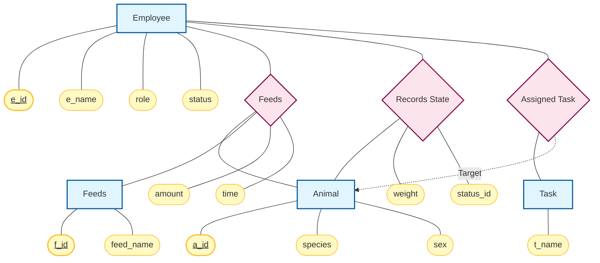
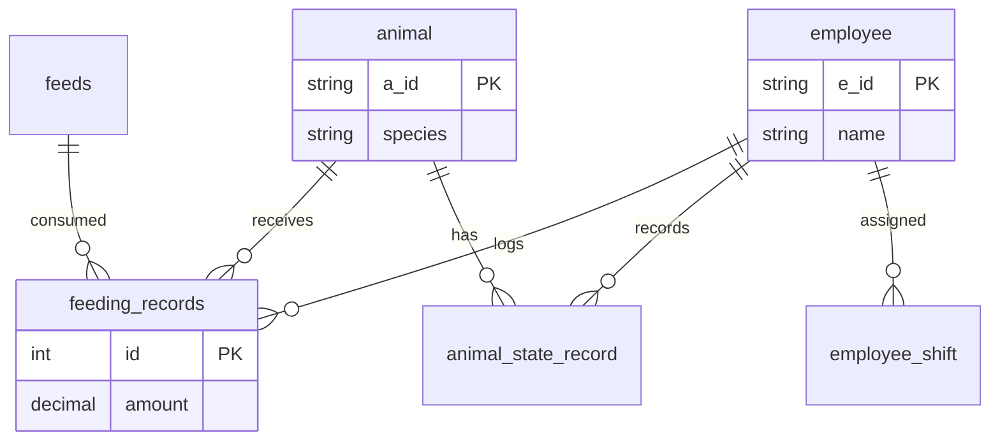

# Zoo Database ER Diagram (Conceptual - Chen's Notation Style)

```mermaid
flowchart TD
    %% Styles
    classDef entity fill:#e1f5fe,stroke:#01579b,stroke-width:2px;
    classDef attribute fill:#fff9c4,stroke:#fbc02d,stroke-width:1px;
    classDef pk fill:#fff9c4,stroke:#fbc02d,stroke-width:2px,text-decoration:underline;
    classDef relationship fill:#fce4ec,stroke:#880e4f,stroke-width:2px,shape:diamond;

    %% --- Employee ---
    E[Employee]:::entity
    E_id([e_id]):::pk
    E_name([e_name]):::attribute
    E_role([role]):::attribute
    E_status([status]):::attribute
    
    E --- E_id
    E --- E_name
    E --- E_role
    E --- E_status

    %% --- Animal ---
    A[Animal]:::entity
    A_id([a_id]):::pk
    A_species([species]):::attribute
    A_sex([sex]):::attribute
    
    A --- A_id
    A --- A_species
    A --- A_sex

    %% --- Feeds ---
    F[Feeds]:::entity
    F_id([f_id]):::pk
    F_name([feed_name]):::attribute
    
    F --- F_id
    F --- F_name

    %% --- Relationships ---
    
    %% Feeding (Action)
    R_Feed{Feeds}:::relationship
    R_Feed_attr([amount]):::attribute
    R_Feed_time([time]):::attribute
    
    E --- R_Feed
    R_Feed --- A
    R_Feed --- F
    R_Feed --- R_Feed_attr
    R_Feed --- R_Feed_time

    %% Care / Record (Action)
    R_Record{Records State}:::relationship
    R_Record_w([weight]):::attribute
    R_Record_s([status_id]):::attribute
    
    E --- R_Record
    R_Record --- A
    R_Record --- R_Record_w
    R_Record --- R_Record_s

    %% Schedule (Action)
    R_Task{Assigned Task}:::relationship
    T[Task]:::entity
    T_name([t_name]):::attribute
    
    T --- T_name
    E --- R_Task
    R_Task --- T
    R_Task -.->|Target| A

```

# Zoo Database Schema (Physical - Crow's Foot Notation)

```mermaid
erDiagram
    employee ||--o{ feeding_records : logs
    employee ||--o{ animal_state_record : records
    employee ||--o{ employee_shift : assigned
    animal ||--o{ feeding_records : receives
    animal ||--o{ animal_state_record : has
    feeds ||--o{ feeding_records : consumed
    
    employee {
        string e_id PK
        string name
    }
    animal {
        string a_id PK
        string species
    }
    feeding_records {
        int id PK
        decimal amount
    }
```